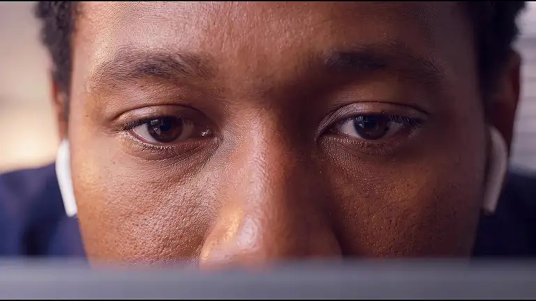

# QuietGlass

**Privacy for what’s on your Mac.**

[Download for Mac](https://github.com/clintonimaroo/quietglass/releases/latest) · macOS 14 or later · Apple silicon and Intel

QuietGlass is an open-source, native macOS app that helps keep your work private in cafés, shared offices, classrooms, and other places where people can see your screen. With compatible AirPods, it blurs your displays when you look away and clears them when you look back.

Privacy also matters while you’re looking at your screen. **Nearby people spots another face in your camera’s view and warns you or blurs the screen, even while you’re still looking.** It works without AirPods. Optional **Recognize me** checks your saved face and a short movement sequence before clearing the camera response.

For everyday control, blur every display instantly, protect a specific window or selected area, blur detected sensitive text, or use **Focus mode** to keep the active window clear while its surroundings fade away. Adjust profiles and app rules from the controls beside the notch. Screen content, camera frames, and motion data are processed on your Mac.

<p align="center">
  
</p>

## Features

| Feature | What it does |
| --- | --- |
| Look-away protection | Uses compatible AirPods to detect changes in head direction and apply screen blur. |
| Instant privacy | Blurs your displays with a keyboard shortcut or the on-screen controls. |
| Window and area protection | Covers a selected window or a specific region of your screen. |
| Focus mode | Keeps the active window clear while blurring surrounding content. |
| Protection profiles | Provides Home, Office, Public, and Focus presets, with adjustable blur and sensitivity. |
| App rules | Applies standard, stronger, or paused head-tracking protection to individual applications. |
| Sensitive text detection | Identifies supported sensitive content and custom phrases using local text recognition. |
| Nearby people | Uses the camera to detect additional visible faces and respond with a warning or automatic blur. |
| Recognize me | Adds optional owner face enrollment and matching to camera-based protection. |

## Getting started

### Requirements

- macOS 14 or later
- Compatible AirPods for head tracking
- A camera for Nearby people and Recognize me

Manual screen blur, window protection, area protection, and Focus mode work without AirPods or a camera.

### Installation

1. Download and unzip the latest release, then move `QuietGlass.app` into Applications.
2. Open QuietGlass.
3. Grant **Screen Recording** access when prompted.
4. Hover over the control bar above the Dock to access protection controls and settings.

The current download is locally signed and not Apple-notarized. If macOS blocks the first launch, follow the **Open Anyway** instructions included in the download.

### Choose your setup

- **For immediate privacy:** use **Blur screen now**, or press **⌃⌥⌘P**.
- **For look-away protection:** connect your AirPods, select **Start tracking**, and follow the calibration steps.
- **For camera protection:** open **Settings → Protection → Nearby people**, enable detection, and choose a warning or automatic blur.
- **For owner recognition:** select **Set up my face**, authenticate with Touch ID or your Mac password, and follow the circular camera guide. Save your face when enrollment is complete.

See the [camera protection guide](CAMERA-PROTECTION.md) for setup details, recognition behavior, and privacy.

## Permissions

QuietGlass requests permissions for the features you choose to use.

| Permission or authentication | Purpose |
| --- | --- |
| Screen Recording | Captures screen content for blur rendering and local text analysis. |
| Motion & Fitness | Reads supported AirPods motion for head tracking. |
| Camera | Supports nearby-person detection and optional owner enrollment. |
| Touch ID or Mac password | Authorizes owner enrollment and access to saved face data. |

## Keyboard shortcuts

| Shortcut | Action |
| --- | --- |
| ⌃⌥⌘P | Toggle full-screen blur |
| ⌃⌥⌘A | Select an area to protect |
| ⌃⌥⌘C | Recenter or start head tracking |
| ⌃⌥⌘Space | Hold to peek through manual screen blur |
| Escape | Clear protection and stop camera monitoring |
| ⌘S | Toggle the settings sidebar |

## Privacy

QuietGlass processes screen content, recognized text, camera frames, and motion data on your Mac.

- Screen images, camera frames, recognized text, and motion history are processed without being saved or uploaded by QuietGlass.
- Preferences, app rules, and custom phrases are stored locally.
- Optional owner enrollment stores a face template in the encrypted macOS Keychain. Saved face data can be deleted in Settings.
- Camera access is limited to enrollment and enabled Nearby people monitoring. Your detection setting is remembered across app launches. Monitoring pauses while your Mac is inactive and resumes when you return. Turning detection off or pressing Escape keeps it off until you enable it again.
- QuietGlass does not record microphone audio.
- Core protection features do not require a hosted backend or cloud inference.

QuietGlass complements macOS screen locking with control over everyday screen visibility.

## Development

QuietGlass uses Swift Package Manager and native Apple frameworks.

### Prerequisites

- Xcode 26 or later, with its command-line tools selected
- Access to the project repository

### Build and run

```sh
git clone https://github.com/clintonimaroo/quietglass.git
cd quietglass

swift test
bash build.sh

open ../Build.noindex/QuietGlass.app
```

The build script produces:

```text
../Build.noindex/QuietGlass.app
../QuietGlass.zip
```

The app is built for the current Mac’s architecture. Standard builds use the bundled recognition model and require no API keys or additional model downloads.

### Project structure

```text
QuietGlass/
├── Sources/
│   ├── QuietGlass/          # Application, UI, capture, and platform integrations
│   └── ShieldCore/          # Protection policies and shared decision logic
├── Tests/
│   ├── QuietGlassTests/     # Application and integration tests
│   └── ShieldCoreTests/     # Policy and behavior tests
├── Resources/              # App metadata, icons, preview assets, and licenses
├── scripts/                # Signing, model conversion, and build utilities
├── Package.swift           # Package and target configuration
└── build.sh                # Application packaging and signing
```

### Architecture

The application layer manages windows, controls, permissions, and system integrations. ShieldCore contains the protection rules and state transitions that determine how the app responds.

| Area | Technology |
| --- | --- |
| Interface and desktop integration | SwiftUI, AppKit |
| Screen capture and blur | ScreenCaptureKit, Core Image |
| AirPods head tracking | Core Motion |
| Camera input | AVFoundation |
| Text and face detection | Vision |
| Owner face matching | Core ML with the bundled SFace model |
| Authentication and template storage | LocalAuthentication, macOS Keychain |

### Testing

```sh
swift test
```

Automated tests cover protection policies, calibration, screen geometry, text matching, camera state handling, owner enrollment, and template storage.

Hardware and interaction checks are recorded in the [validation notes](VALIDATION.md).

## Product direction

QuietGlass is being built as an open-source macOS product with a simple goal: make screen privacy a natural part of daily work. Its source is available to inspect, build, modify, and contribute to under the MIT license.

Development follows four principles:

1. **Native experience:** controls, motion, and settings that feel at home on macOS.
2. **Local processing:** keep sensitive screen and camera data on the device.
3. **User control:** make protection easy to start, adjust, pause, and clear.
4. **Focused scope:** prioritize useful privacy workflows over unnecessary features.

## Product roadmap

The following phases describe the planned direction.

| Phase | Focus |
| --- | --- |
| Everyday experience | Refine onboarding, calibration, camera setup, accessibility, display handling, and power efficiency. |
| Public releases | Establish signed and notarized distribution, automatic updates, release documentation, and a clear feedback process. |
| Smarter workflows | Expand application rules, profile automation, shortcut integrations, and protection preferences for different work environments. |
| Teams and professional use | Explore managed deployment, shared configuration, and optional paid support for organizations. |

Open-source development can be supported through optional paid distribution, support, and professional services. The project’s source remains available under its open-source license.

## Contributing

Bug reports, documentation improvements, and focused pull requests are welcome. Open an issue before starting a substantial feature or architectural change so the approach can be discussed.

See [Contributing](CONTRIBUTING.md) for setup, verification, and pull request guidance.

## Security

Please report vulnerabilities privately using the [Security Policy](SECURITY.md).

## Ownership and licensing

QuietGlass is developed by Clinton Imaro and released under the [MIT License](LICENSE).

Third-party models, icons, and other bundled components retain their respective licenses and attribution requirements. See the [icon license](Resources/Icons/LICENSE.md) and [SFace model license](Resources/Models/SFace-LICENSE.txt).
